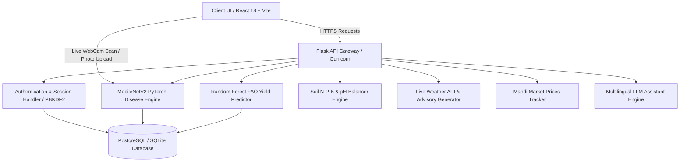
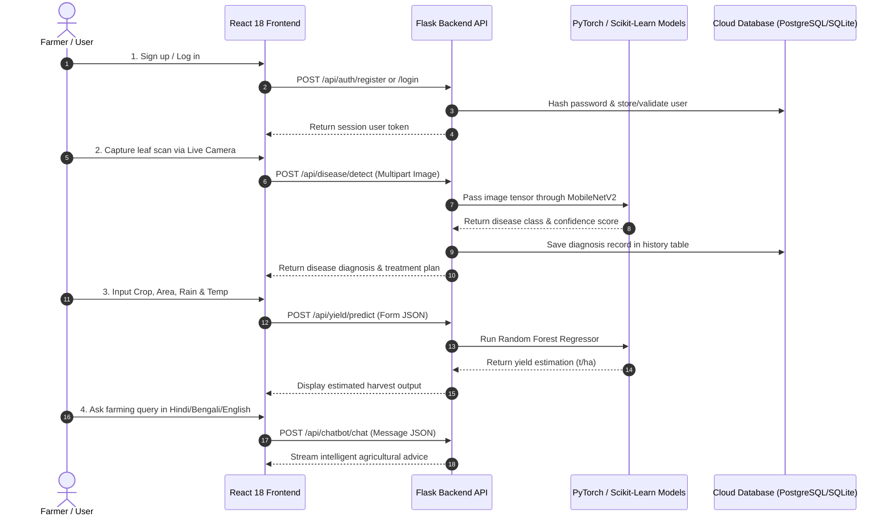

# 🌾 AgriAI — AI-Powered Smart Agriculture Platform

[](http://localhost:5173/)
[](https://vitejs.dev/)
[](https://flask.palletsprojects.com/)
[](https://vercel.com)

**AgriAI** is an advanced, full-stack smart farming Web Application designed to empower farmers and agricultural experts with real-time machine learning predictions, computer vision disease diagnosis, meteorological advisories, and multilingual AI consultation.

---

## 🔄 System Architecture & Workflow

### 1. High-Level System Architecture



### 2. User Dataflow & Decision Journey



---

## 🛠️ Core Feature Workflows

### 🍃 A. AI Plant Disease Detection
1. **Input Stage**: The user either uploads a leaf photo (PNG/JPG/WEBP) or uses the **Live WebCam Camera Scanner** with a real-time viewfinder target box.
2. **Preprocessing**: Image tensor resized to $224 \times 224$, normalized with standard ImageNet mean & standard deviation vectors.
3. **Inference**: Passed through a fine-tuned **MobileNetV2** deep convolutional neural network.
4. **Output**: Returns disease classification, prediction confidence percentage, and customized biological/chemical treatment actions.

### 🌾 B. Crop Yield Estimation
1. **Input**: Country, Crop Type, Harvest Area ($ha$), Annual Rainfall ($mm$), Temperature ($^\circ C$), and Fertilizer input.
2. **ML Engine**: Scikit-Learn **Random Forest Regressor** pre-trained on historic **FAO (Food and Agriculture Organization)** dataset records.
3. **Output**: Yield output estimate in tonnes per hectare ($t/ha$) with comparative metrics.

### 🧪 C. Soil Nutrient Balancing
1. **Input**: Soil Nitrogen ($N$), Phosphorus ($P$), Potassium ($K$), and $pH$ acidity level.
2. **Rule Engine**: Evaluates optimal target ranges for selected crop type.
3. **Output**: Calculates specific fertilizer ratios ($Urea$, $DAP$, $MOP$) and lime/gypsum soil amendments.

### 💬 D. Multilingual Advisory Chatbot
1. **Input**: Text prompt in English, Hindi, or Bengali.
2. **LLM Engine**: Context-aware prompt template tailored to regional crop conditions, weather risks, and pest control.
3. **Output**: Returns localized advice in the user's native language.

---

## 🌟 Key Features

- 🍃 **AI Leaf Disease Detection**: Upload or scan crop leaf photos using the **Live WebCam Camera Scanner** to detect plant diseases instantly with MobileNetV2 computer vision and get actionable treatment plans.
- 🌾 **Crop Yield Prediction**: Predict harvest yield ($t/ha$) powered by Random Forest ML models trained on real FAO agricultural datasets.
- 🧪 **Soil & Fertilizer Balance**: Input Soil N-P-K & pH levels to calculate precise fertilizer ratios and soil health recommendations.
- ☀️ **Real-time Weather Advisory**: Live meteorological forecasts with 3-day farming action plans tailored to your location.
- 📈 **Mandi Market Prices**: Real-time commodity price tracking across states and markets.
- 💬 **Multilingual AI Assistant**: Instant consultation in **English**, **Hindi (हिंदी)**, and **Bengali (বাংলা)**.
- 🌗 **Theme Support**: Seamless Light & Dark mode glassmorphic UI.

---

## 🛠️ Technology Stack

### **Frontend**
- **Framework**: React 18 (Vite)
- **Styling**: Vanilla CSS3 (Custom Design System, Glassmorphism, Theme Variables)
- **Icons**: Lucide React
- **Internationalization**: i18next (English, Hindi, Bengali)
- **Routing**: React Router v6

### **Backend**
- **Framework**: Flask (Python 3)
- **Machine Learning**: PyTorch (MobileNetV2 Vision Model), Scikit-Learn (Random Forest Regressors)
- **Database**: Flask-SQLAlchemy (Supports SQLite locally & PostgreSQL in production)
- **Authentication**: Secure Session Tokens with PBKDF2 SHA-256 Password Hashing
- **Production Server**: Gunicorn WSGI

---

## 📂 Project Structure

```text
Agri-ai/
├── backend/
│   ├── app.py                # Flask Application Factory & Route Registration
│   ├── models_db.py          # SQLAlchemy Models (User, DiseaseHistory, PredictionHistory)
│   ├── requirements.txt      # Python Dependencies (PyTorch, Flask, Gunicorn, psycopg2)
│   ├── Procfile              # Railway Production Deployment Configuration
│   ├── routes/               # Modular API Route Handlers
│   │   ├── auth.py           # User Authentication Routes
│   │   ├── disease.py        # PyTorch Image Scanner API
│   │   ├── yield_predict.py  # FAO Yield Predictor API
│   │   ├── soil.py           # Soil N-P-K Nutrient Balancer
│   │   ├── weather.py        # Live Meteorology API
│   │   ├── market.py         # Mandi Commodity Prices API
│   │   └── chatbot.py        # Multilingual Farmer Assistant API
│   └── ml_training/          # ML Model Training Scripts & Datasets
├── frontend/
│   ├── src/
│   │   ├── api/client.js     # API Axios/Fetch Integration with Authorization Headers
│   │   ├── components/       # Reusable UI Components (Navbar, ThemeToggle, LanguageSwitcher)
│   │   ├── pages/            # Page Views (Landing, Dashboard, Tools, Login, Signup)
│   │   ├── i18n/             # Locale Translations (en, hi, bn)
│   │   └── index.css         # Global Glassmorphic Design System
│   ├── vercel.json           # Vercel SPA Client-Side Routing Configuration
│   └── package.json          # Frontend Dependencies & Scripts
├── .gitignore                # Environment & Build Ignore Rules
└── README.md                 # Project Documentation
```

---

## 🚀 Quick Local Setup

### 1. **Backend Setup**

```bash
# Navigate to backend directory
cd backend

# Install Python dependencies
pip install -r requirements.txt

# Run the Flask backend server
python app.py
```
*Backend will start on `http://localhost:5000`*

### 2. **Frontend Setup**

```bash
# Navigate to frontend directory
cd frontend

# Install Node dependencies
npm install

# Start the Vite development server
npm run dev
```
*Frontend will start on `http://localhost:5173`*

---

## 🌐 Deployment Instructions

### **Backend Deployment (Railway.app)**
1. Connect your GitHub repository to **[Railway.app](https://railway.app)**.
2. Add a **PostgreSQL** database service in Railway.
3. Configure Backend Settings:
   - **Root Directory**: `backend`
   - **Start Command**: `gunicorn "app:create_app()"`
   - **Variables**: `GEMINI_API_KEY`, `DATABASE_URL` (linked to Railway Postgres)

### **Frontend Deployment (Vercel.com)**
1. Import your GitHub repository to **[Vercel.com](https://vercel.com)**.
2. Configure Project Settings:
   - **Root Directory**: `frontend`
   - **Build Command**: `npm run build`
   - **Output Directory**: `dist`
   - **Environment Variable**: `VITE_API_URL` = `https://your-railway-backend-url.up.railway.app/api`

---

## 📜 License

This project is licensed under the MIT License — see the [LICENSE](LICENSE) file for details.
