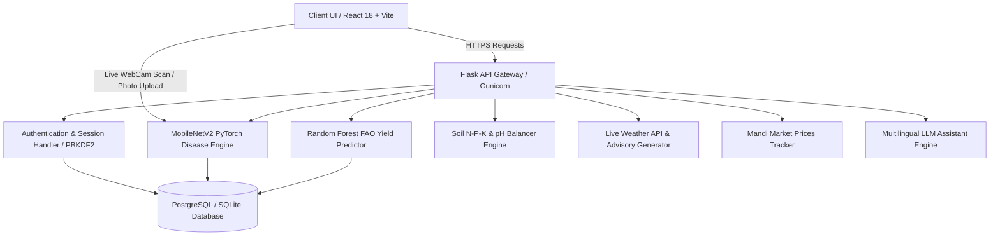
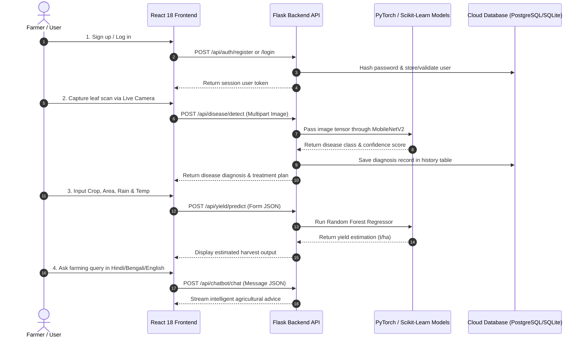

# 🌾 AgriAI — AI-Powered Smart Agriculture Platform

[](http://localhost:5173/)
[](https://vitejs.dev/)
[](https://flask.palletsprojects.com/)
[](https://vercel.com)

**AgriAI** is an advanced, full-stack smart farming Web Application designed to empower farmers and agricultural experts with real-time machine learning predictions, computer vision disease diagnosis, meteorological advisories, and multilingual AI consultation.

---

## 🌟 Key Features

| Icon | Feature | Description | Engine / Model |
| :---: | :--- | :--- | :--- |
| 🍃 | **AI Leaf Disease Detection** | Upload or scan crop leaf photos using the **Live WebCam Camera Scanner** to detect plant diseases instantly with actionable treatment plans. | PyTorch MobileNetV2 Deep CNN |
| 🌾 | **Crop Yield Prediction** | Predict harvest output in tonnes per hectare ($t/ha$) based on harvest area, rainfall, temperature, and crop type. | Scikit-Learn Random Forest Regressor (FAO Dataset) |
| 🧪 | **Soil Nutrient Balancer** | Calculate optimal N-P-K & pH fertilizer ratios ($Urea$, $DAP$, $MOP$) and soil acidity amendments for selected crops. | Rule-based Soil Chemistry Balancer |
| ☀️ | **Real-Time Weather Advisory** | Live meteorological forecasts with 3-day customized farming recommendations tailored to your location. | Live Weather API Integration |
| 📈 | **Mandi Market Prices** | Track real-time crop commodity price trends across various Indian states and markets. | Real-Time Mandi Market Tracker |
| 💬 | **Multilingual AI Assistant** | Instant 24/7 agricultural consultation in **English**, **Hindi (हिंदी)**, and **Bengali (বাংলা)**. | Multilingual LLM Advisory Engine |
| 🌗 | **Adaptive Theme System** | Glassmorphic UI with automatic Light & Dark mode support and responsive mobile drawer navigation. | Vanilla CSS3 Variables & Glassmorphism |

---

## 🛠️ Technology Stack

| Domain | Technology / Library | Version | Purpose & Usage |
| :--- | :--- | :--- | :--- |
| **Frontend Core** | React 18 | `v18.3.1` | Declarative component UI library |
| **Build System** | Vite | `v8.2.1` | Ultra-fast frontend development server & bundler |
| **Icons & UI** | Lucide React | `v0.453.0` | Modern, lightweight UI icon library |
| **Internationalization** | i18next / react-i18next | `v23.16.2` | Multilingual support for English, Hindi, and Bengali |
| **Routing** | React Router DOM | `v6.27.0` | Client-side Single Page Application (SPA) routing |
| **Backend Core** | Flask | `v3.0.3` | Python micro-framework for modular RESTful API routes |
| **Deep Learning** | PyTorch | `v2.4.0` | MobileNetV2 computer vision CNN model inference |
| **Machine Learning** | Scikit-Learn | `v1.5.1` | Random Forest Crop Yield Regressor |
| **Data Processing** | NumPy & Pandas | `v1.26.4 / v2.2.2` | Dataset transformations and array matrix calculations |
| **Database ORM** | Flask-SQLAlchemy | `v3.1.1` | Object-Relational Mapper (SQLite locally, PostgreSQL in cloud) |
| **Cloud Driver** | psycopg2-binary | `v2.9.9` | Production PostgreSQL Python database connector |
| **Production Server** | Gunicorn | `v22.0.0` | High-performance Python WSGI HTTP server |
| **Deployment (Backend)** | Railway | — | Flask API & PostgreSQL cloud hosting |
| **Deployment (Frontend)** | Vercel | — | Static React SPA hosting with SPA fallback rewrites |

---

## 🔄 System Architecture & Workflow

### 1. High-Level System Architecture



### 2. User Dataflow & Decision Journey



---

## 📂 Project Structure

```text
Agri-ai/
├── backend/
│   ├── app.py                # Flask Application Factory & Route Registration
│   ├── models_db.py          # SQLAlchemy Models (User, DiseaseHistory, PredictionHistory)
│   ├── requirements.txt      # Python Dependencies (PyTorch, Flask, Gunicorn, psycopg2)
│   ├── Procfile              # Railway Production Deployment Configuration
│   ├── routes/               # Modular API Route Handlers
│   │   ├── auth.py           # User Authentication Routes
│   │   ├── disease.py        # PyTorch Image Scanner API
│   │   ├── yield_predict.py  # FAO Yield Predictor API
│   │   ├── soil.py           # Soil N-P-K Nutrient Balancer
│   │   ├── weather.py        # Live Meteorology API
│   │   ├── market.py         # Mandi Commodity Prices API
│   │   └── chatbot.py        # Multilingual Farmer Assistant API
│   └── ml_training/          # ML Model Training Scripts & Datasets
├── frontend/
│   ├── src/
│   │   ├── api/client.js     # API Axios/Fetch Integration with Authorization Headers
│   │   ├── components/       # Reusable UI Components (Navbar, ThemeToggle, LanguageSwitcher)
│   │   ├── pages/            # Page Views (Landing, Dashboard, Tools, Login, Signup)
│   │   ├── i18n/             # Locale Translations (en, hi, bn)
│   │   └── index.css         # Global Glassmorphic Design System
│   ├── vercel.json           # Vercel SPA Client-Side Routing Configuration
│   └── package.json          # Frontend Dependencies & Scripts
├── .gitignore                # Environment & Build Ignore Rules
└── README.md                 # Project Documentation
```

---

## 🚀 Quick Local Setup

### 1. **Backend Setup**

```bash
# Navigate to backend directory
cd backend

# Install Python dependencies
pip install -r requirements.txt

# Run the Flask backend server
python app.py
```
*Backend will start on `http://localhost:5000`*

### 2. **Frontend Setup**

```bash
# Navigate to frontend directory
cd frontend

# Install Node dependencies
npm install

# Start the Vite development server
npm run dev
```
*Frontend will start on `http://localhost:5173`*

---

## 🌐 Deployment Instructions

### **Backend Deployment (Railway.app)**
1. Connect your GitHub repository to **[Railway.app](https://railway.app)**.
2. Add a **PostgreSQL** database service in Railway.
3. Configure Backend Settings:
   - **Root Directory**: `backend`
   - **Start Command**: `gunicorn "app:create_app()"`
   - **Variables**: `GEMINI_API_KEY`, `DATABASE_URL` (linked to Railway Postgres)

### **Frontend Deployment (Vercel.com)**
1. Import your GitHub repository to **[Vercel.com](https://vercel.com)**.
2. Configure Project Settings:
   - **Root Directory**: `frontend`
   - **Build Command**: `npm run build`
   - **Output Directory**: `dist`
   - **Environment Variable**: `VITE_API_URL` = `https://your-railway-backend-url.up.railway.app/api`

---

## 📜 License

This project is licensed under the MIT License — see the [LICENSE](LICENSE) file for details.
